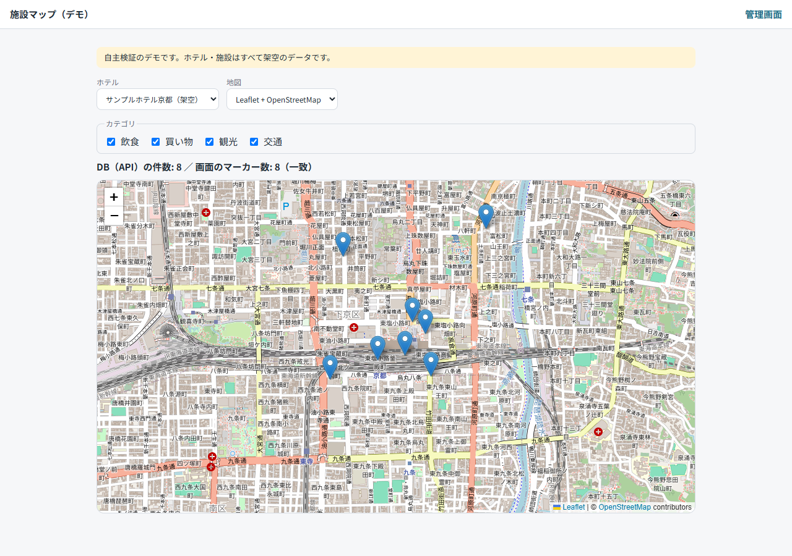
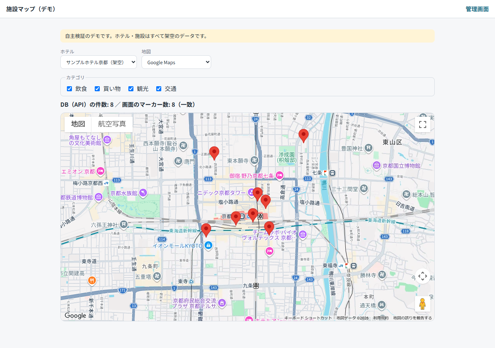
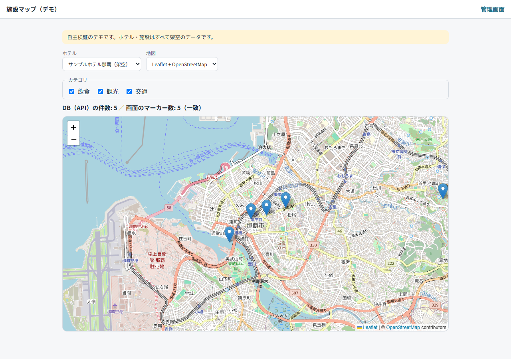
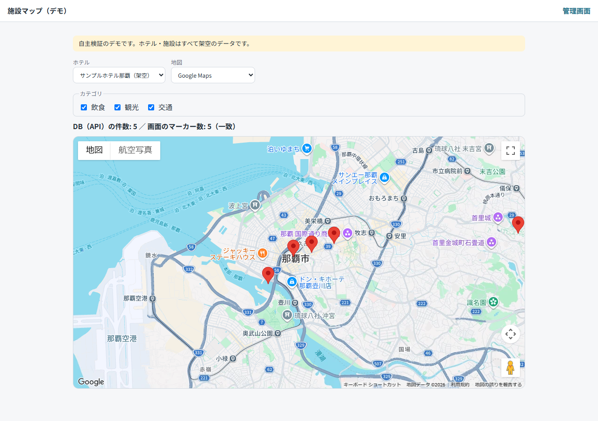
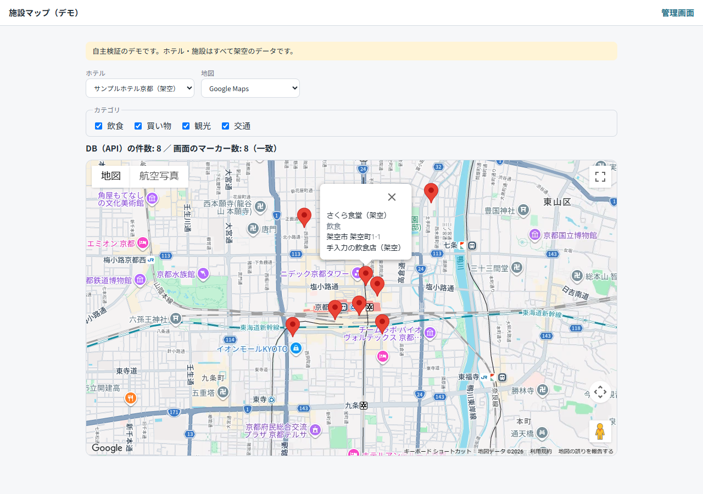
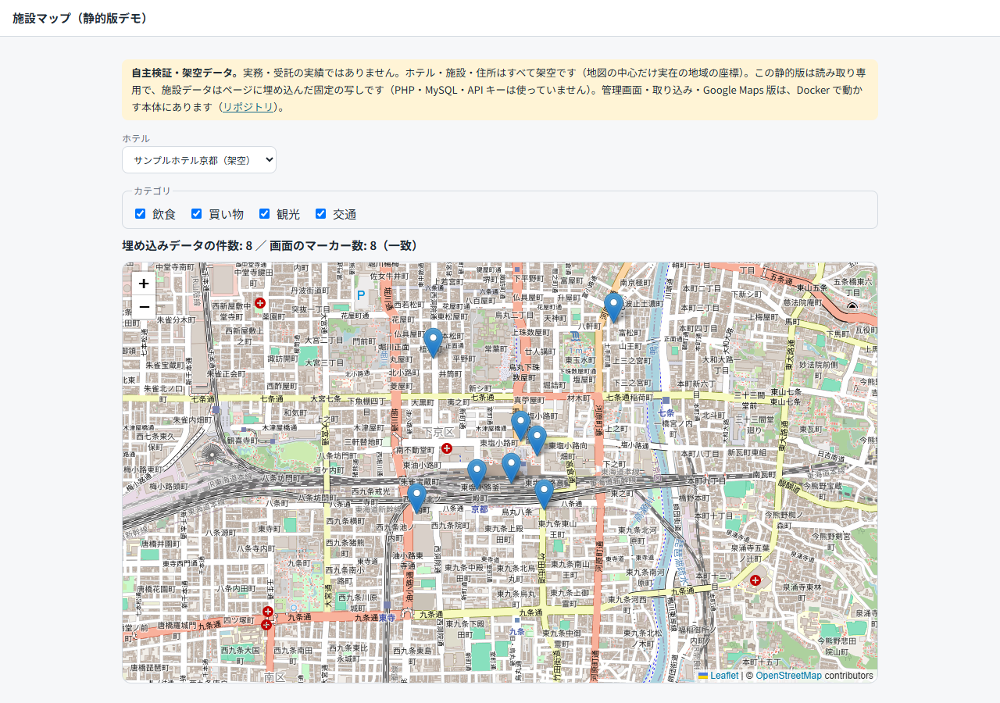
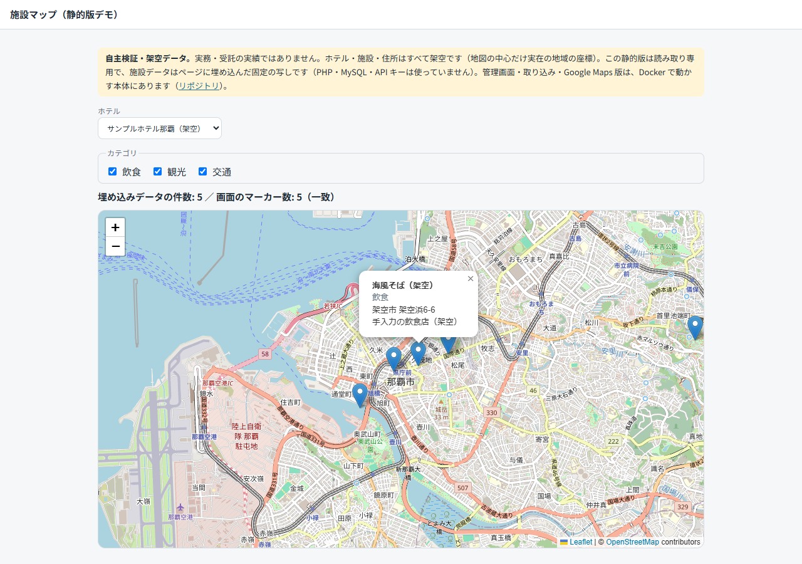
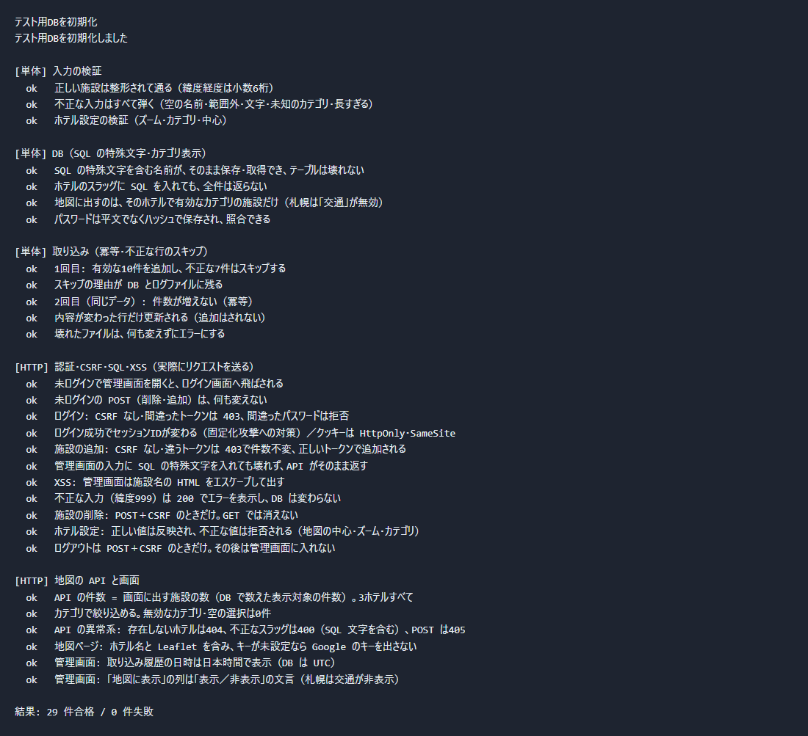

# 施設マップ × 管理画面 の小さなデモ（case15・自主検証）

**自主検証のデモです。閲覧用に公開しています。**

「ホテルごとに施設情報を持ち、地図に表示し、管理画面で編集でき、外部データを取り込める」の最小構成。
**自作の自主検証で、実務・受託の実績ではない。** ホテル・施設・人物はすべて架空（地図の中心だけ実在の地域の座標）。既存の特定のシステムは見ておらず、再現もしていない。

- 着手: 2026-09-24 23:49（最初のコミット 23:52:10）。完成の時刻は下の「経過」を参照（`git log` の時刻であり、作業時間そのものではない）

## 動かし方（Docker のみ。ローカルに PHP は不要）
```bash
cp .env.example .env        # 値を自分のものに直す（.env はコミットしない）
docker compose up -d --build
```
- 地図: http://localhost:8080/ ／ 管理画面: http://localhost:8080/admin/ （ユーザー名・パスワードは `.env` の `ADMIN_USERNAME` / `ADMIN_PASSWORD`）
- **ポートは 8080 固定**（Google のキーのリファラ制限が `http://localhost:8080/*` のため）
- 初回起動で、テーブル作成 → 架空のホテル3件と施設 → 管理者 → モックの取り込み、まで自動で行う
- 取り込みだけ再実行: `docker compose exec web php scripts/import.php`
- テスト: `docker compose --profile test up -d --build web_test` → `docker compose --profile test exec -T web_test php tests/run_all.php`
- わざと壊す確認: `python tests/mutation_check.py`（コードのコピーを壊して、テストが赤になることを確かめる）

## 静的版（閲覧用・`static/`）
Docker 無しで見られる、**読み取り専用**の地図ページ。Leaflet + OpenStreetMap のみ（API キー・PHP・MySQL は使わない）。ホテルの切り替え・カテゴリの絞り込み・情報ウィンドウ。画面に「自主検証・架空データ」と明記している。
- 中身: `static/index.html`・`app.js`・`data.js`（施設データの**固定の写し**）・`style.css`・`vendor/leaflet/`（Leaflet 1.9.4・BSD-2-Clause）
- データの作り方: 動いているデモの API から生成 → `node scripts/build_static.mjs`（`data.js` は手で編集しない。デモのデータを変えたら作り直す）
- 手元で見る: `static/` で `python -m http.server 8090` → http://localhost:8090/ （`file://` の直接表示は未確認）
- CSP は `default-src 'none'`（外部通信は OSM のタイルだけ許可・`connect-src 'none'`）。**Netlify に載せると、Netlify が自動で入れるスクリプトが CSP で止められ、公開版だけコンソールにエラーが出ることがある**（画面の動作には影響しない・過去の別デモでの経験。この静的版では公開後の確認は未実施）
- **Netlify Drop は、載せたサイトを丸ごと置き換える。既存のサイトに `static/` を直接ドロップしない**（別サイトとして作るか、既存サイトの公開用フォルダにサブフォルダとして足す）
- 検査: `node tests/static_check.mjs`（27 件・データが API と一致／キーや Google の読み込みが無い／外部 URL は OSM のみ／明記あり）と `tests/static_e2e.mjs`（28 件・ブラウザで実操作）。実出力: `docs/evidence/static_check_output.txt`・`static_e2e_output.txt`
- 静的版は、管理画面・取り込み・Google Maps 版を**含まない**（それらは Docker で動かす本体）

## 画面（`docs/screens/`・Playwright で自動撮影。`node tests/capture_screens.mjs`）
撮影は画面の中身だけ（開発者ツール・`.env`・キーは写っていない。ログイン画面は入力前の状態）。Google 版は 2026-09-25 にキーを入れて撮影。

| 地図（Leaflet + OpenStreetMap） | 地図（Google Maps） |
|---|---|
|  |  |
|  |  |

- 京都・Google 版でマーカーを押した状態（情報ウィンドウ）: 
- 管理画面: [ログイン](docs/screens/05_admin_login.png) ／ [ホテル一覧と取り込み結果](docs/screens/06_admin_index_import_history.png) ／ [ホテルの設定・施設一覧](docs/screens/07_admin_hotel_facilities.png) ／ [施設の編集](docs/screens/08_admin_facility_edit.png)
- 静的版（Leaflet + OSM のみ）:  
- テスト 29件合格: （`docs/evidence/test_output.txt` の実出力を端末風に描いた画像）
- 取り込み結果の画面（06）の日時は日本時間（DB は UTC で保存し、表示するときに変換。見出しにも「日本時間」と表示）。
- 画面の地図の背景は、各社の地図が持つ実在の地名を含む。施設・ホテル・住所は架空で、座標だけ実在の地域。

## 作ったもの
| 機能 | 内容 |
|---|---|
| 地図ページ | DB の施設をマーカーで表示。ホテルの切り替え・カテゴリの絞り込み・マーカーを押すと情報ウィンドウ。**API の件数と画面のマーカー数を並べて表示**（不一致なら警告） |
| 管理画面 | ログイン（パスワードは `password_hash`）／ホテルごとの設定（地図の中心・ズーム・表示するカテゴリ）／施設の追加・編集・削除 |
| セキュリティ | 未ログインは弾く／POST は CSRF トークン必須／SQL は全てプレースホルダ（PDO）／出力は HTML エスケープ／ログイン時にセッションIDを作り直す／クッキーは HttpOnly・SameSite=Lax |
| 取り込み | ローカルのモック JSON（`data/mock_facilities.json`・架空）から施設を取り込む。取得元＋外部ID で**冪等**。不正な行はスキップし、DB（`import_skipped`）と `logs/import_skipped.log` に理由を残す |
| 地図アダプタ | `public/assets/js/adapters/`。**Leaflet + OpenStreetMap**（必須・キー不要）と **Google Maps**（キーがあるときだけ有効） |
| 設計提案メモ | `docs/DESIGN_PROPOSALS.md`（キーの制限と費用／座標の保存方針／スキーマと AI 検索の差し込み口。出典つき・未確認は明記） |

## 実測した数字（2026-09-25・Docker 上で実行）
- **マーカー数 = API の件数 = DB の表示対象の件数**（Leaflet 版・ブラウザで確認。Google 版は下の節）: **京都 8・札幌 4 はブラウザで、画面のマーカー数まで確認**（札幌は DB に5件あるが、「交通」を表示しない設定なので1件は出ない）。**那覇 5 は 2026-09-25 の自動撮影で、画面のマーカー数まで確認**（`docs/screens/measurements.json`）。カテゴリを素早く切り替える操作を10回繰り返しても、京都の画面・API・DB が一致
- **取り込み**: 1回目 追加10・スキップ7 → 2回目（同じデータ）**追加0・更新0・変更なし10**・スキップ7（施設は計18件のまま）: `docs/evidence/import_output.txt`（DB の `import_runs` の実出力）
- **テスト 29件合格**（規則の単体 12＋HTTP 17。実際にリクエストを送って、未ログイン・CSRF・SQL の特殊文字・XSS・API の異常系を確認）: `docs/evidence/test_output.txt`
- **わざと壊した7か所すべてで、テストが赤**（認可／CSRF／冪等／SQL のプレースホルダ／HTML エスケープ／セッションID／表示カテゴリ）: `docs/evidence/mutation_check_output.txt`
- 見つけて直した不具合: カテゴリを素早く切り替えると、古い応答が後から届いて表示を上書きした（ブラウザで再現→修正→10回連続で一致を確認）
- 見つけて直した見た目の不具合（2026-09-25・撮影した画像で発見）: 管理画面のホテル設定で、カテゴリのチェックボックスが縦に中央寄せになっていた（`.card label` の指定が `.check` に勝っていた）→ `app.css` に1行足して修正。テスト 27件は修正後も合格
- 見つけて直した不具合（取り込み履歴の日時）: 管理画面の「日時」が日本時間でなく世界標準時（UTC）のまま出ていた（MySQL が UTC で動き、保存された値をそのまま表示していた。PHP の設定は日本時間なのに変換していなかった）→ 表示するときに日本時間へ変換し、見出しを「日時（日本時間）」に。テスト 2 件（変換の値・画面の文言）を追加し、わざと元に戻すと赤になることを確認（`mutation_check.py` の 7 変異には未追加）
- 見つけて直した見た目の不具合（「地図に表示」の列）: 表示対象の行に「○」が出ていて、空のラジオボタンのように見えた（意味は「地図に表示する」で、不具合ではなく紛らわしい表示）→ 「表示」／「非表示（このホテルでは表示しないカテゴリ）」の文言に変更。上のテスト 1 件で確認
- 見つけて直した不具合（静的版・ブラウザでの実操作で発見）: 同じタブで URL の `#kyoto` → `#sapporo` のようにハッシュだけ変えても、ホテルが切り替わらなかった → `hashchange` に追従。修正前は E2E 28 件中 14 件が赤になった
- 見つけて直した不具合（コンソールの 404）: `/favicon.ico` が無く 404 が1件出ていた → 各ページに空のアイコン指定（`<link rel="icon" href="data:,">`）を追加。地図（Leaflet・Google）と管理画面のログインで、コンソールエラー 0 を確認（Edge・自動）

## Google 版の状態: **一部検証済み**（2026-09-25・オーナーが `.env` にキーを入れて実測）
- **確認できたこと**: Google Maps で地図が描画され、**マーカー数 = API の件数**（京都 8・那覇 5。画面の表示と直接の API 呼び出しの件数が一致）。**マーカーを押すと情報ウィンドウ**（施設名・カテゴリ・住所・説明）が出る（京都）。コンソールエラーなし。画像: `docs/screens/03`・`04`・`10`、数値: `docs/screens/measurements.json`
- **確認していないこと**: キーの制限が効いているか（リファラ制限・API 制限はオーナーの設定で、こちらは未確認）／エラー時の挙動（キー不正・請求先なし・API 未有効化の切り分け）／札幌の Google 表示／Google 版でのカテゴリ切り替えの連続操作／費用（利用量・請求）の実測。**確認するまで「動作確認済み」と広げて書かない。**
- キーは `.env` の `GOOGLE_MAPS_API_KEY`（コミットしない。チャットに貼らない）。付けるべき制限（HTTP リファラ `http://localhost:8080/*` と `http://127.0.0.1:8080/*`・Maps JavaScript API のみ・予算アラート）は `docs/DESIGN_PROPOSALS.md` §1。
- キーが無いときは、地図の選択肢に「Google Maps（APIキー未設定・未検証）」が出て、選べない。

## 作っていないもの・未検証の点
- 既存のシステムの再現／AI 検索・AI コンシェルジュの実装（設計メモで差し込み口を示しただけ）／実在のホテル・実在サービスの API の利用
- フレームワークは使っていない（素の PHP + PDO）。Composer・PHPUnit も未使用（自作の小さなテスト実行スクリプト）
- ブルートフォース対策（ログインの試行回数の制限）・パスワード変更・複数の管理者の権限分け・監査ログ・CSP ヘッダー・HTTPS（ローカルの http のみ）は**未実装**
- 静的版は読み取り専用で、施設データは固定の写し（デモの DB を変えても自動では変わらない）。管理画面・取り込み・Google Maps 版は載せていない
- 外部で削除された施設の扱い（論理削除）は未実装（設計メモに記載）
- 取り込みは、管理画面で手編集した「取り込み由来の行」を、次の取り込みで上書きする（手編集を保護する仕様は無い）
- ログインのセッションに有効期限の設定は無い（ブラウザを閉じるまで）。`docker-compose.yml` は 8080・8081 を全インターフェースに公開するので、`.env` の管理者パスワードは必ず自分の値にする
- ブラウザでの画面の確認は、内蔵ブラウザ（Leaflet 版）と Edge の自動撮影（Leaflet・Google の京都・那覇と管理画面）のみ。他のブラウザ・スマホ実機は未確認
- Google の利用規約（緯度経度の保存期間・Google 以外の地図への表示）は、規約本文を取得できず**未確認**

## 構成
`src/`（Db・Repo・Validator・Auth・Csrf・Importer・View）／`public/`（地図ページ・API・管理画面・アダプタ）／`db/`（スキーマ・初期データ）／`scripts/`（起動・取り込み・テスト用DBの初期化）／`tests/`／`docs/`。Leaflet 1.9.4（BSD-2-Clause）を `public/assets/vendor/leaflet/` に同梱している。

## 経過（`git log`）
`git log --format='%h %ad %s' --date=iso` を参照。

## GitHub に公開できる状態かの最終確認（2026-09-25・静的版の追加と修正のコミット後、README・画像のコミット前に再実行）
公開の操作そのものはオーナー。ここは確認結果だけ。

| 確認 | 結果 | 確かめ方 |
|---|---|---|
| `.env` が追跡対象外 | 追跡なし・`.gitignore` の1行目で除外。履歴にも `.env` は 0 件 | `git ls-files` / `git check-ignore -v .env` / `git log --all -- .env` |
| コミットされる設定ファイル | `.env.example` のみ。キーは空、パスワードは `change-me` の見本値 | `git ls-files`・`.env.example` の目視 |
| 履歴に秘密が無い | **10 コミット・約 493KB を走査して 0 件**（gitleaks 8.30.1） | `gitleaks git --redact .` |
| 作業ツリーの走査 | 3 件検出。**すべて未コミットの `.env` 自身**（キーとパスワード。`.gitignore` 済みで公開されない）。ほかは 0 件 | `gitleaks dir --redact .`（検出ファイルを JSON で確認） |
| `.env` の実際の値が追跡ファイルに入っていない | API キー・管理者パスワード・DB パスワード・DB ルートパスワードのいずれも 0 件 | `git grep -F`（値は表示していない） |
| 画像・静的版にキーが入っていない | 画像 12 枚と `static/` に、`.env` のキー文字列は 0 件。画像は目で確認（キー・`.env`・開発者ツール・パスワードの黒丸なし） | 文字列検索と目視 |
| 実名・個人情報 | 本名・メールアドレス・会社名の文字列は 0 件（ファイル全体を検索）。**リポジトリへのリンクとして GitHub のユーザー名（`Hide-Saku`）が `static/index.html` に入っている** | `grep` |
| データが架空 | ホテル・施設・住所はすべて「（架空）」付き（静的版の検査でも確認）。**実在の店名との照合は未実施** | `data/mock_facilities.json`・`db/seed.sql`・`tests/static_check.mjs` |
| ライセンス | **リポジトリの LICENSE は未作成**（作らない方針）。同梱の Leaflet は BSD-2-Clause | `ls LICENSE*` |

- `git grep AIza` は、キーの伏せ字処理・検査の正規表現を書いたスクリプト 2 本（`tests/capture_screens.mjs`・`tests/static_check.mjs`）でだけ当たる。キーそのものではない。
- **キーの扱いの注意**: 本体の地図ページの HTML には、Google のキーが `<meta name="gmaps-key">` として出る（Maps JavaScript API の仕様上、ブラウザに渡る）。だから**リファラ制限と API 制限が必須**。制限を付けていない状態で、キーを入れたデモを外部に公開しない。**静的版はキーを使わない。**
- 公開の直前に `gitleaks git .` を再実行する。

## 画面録画の台本（30〜60秒・オーナーが撮る想定）
1. 地図ページ（京都・Leaflet）: 「DB の件数 8／マーカー数 8（一致）」を見せる
2. カテゴリを外す・戻す（件数と表示が連動して変わる）
3. マーカーを押して情報ウィンドウ
4. 地図の選択を Google Maps に切り替え、同じ件数・同じ位置であることを見せる（キーを入れた環境）
5. ホテルを那覇に切り替える（カテゴリの種類がホテルごとに違う）
6. 管理画面にログイン → ホテル一覧と取り込みの履歴（追加 10・スキップ 7 → 2 回目は変更なし 10）
7. 施設を 1 件編集して保存 → 地図に戻って反映を見せる
8. 最後にテスト 29 件合格の画面（または画像）を見せて、「自主検証で実務の実績ではない」と一言添える
